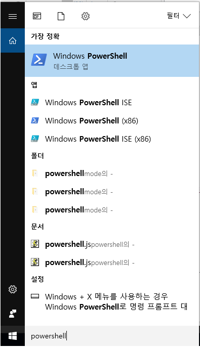
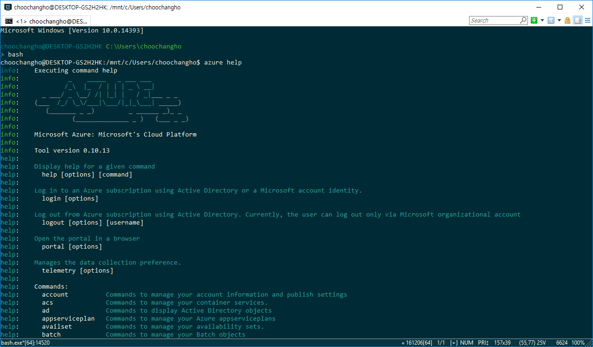
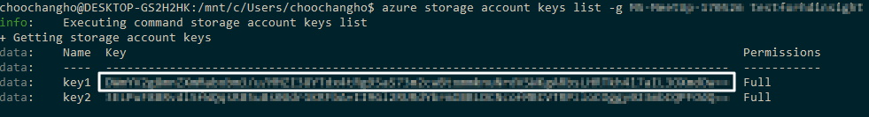

# HDInsight의 Spark 을 이용한 상품 추천 만들기

## 환경 구성

- client : Azure CLI on Window 10
- 배포 도구 : fabric
- 분석 도구 : Python3, Pandas, Spark Machine Learing Library(mllib)
- 데이터 스토리지 : Azure Blob

## Azure CLI on Window 10

### Bash Installation
- [설치가이드][1]

> PowerShell은 관리자 권한으로 실행시키되 64bit로 실행시키면 오류가 발생한다.




### Azure CLI Installation
- [설치가이드][2]

```
$ sudo apt-get install npm
$ sudo npm install azure-cli –g
# 아래가 필요할수도 있다.
($ sudo ln -s /usr/bin/nodejs /usr/bin/node)
# 기본 설치된 nodejs 버전이 낮다.
$ nodejs update
$ curl -sL https://deb.nodesource.com/setup_4.x | sudo -E bash – 
$ sudo apt-get install -y nodejs
```

설치 확인

```
$ azure help
```



## Azure Login

```
$ azure login
```


## HDInsight 클러스터 만들기

### 주의 사항

> `Azure CLI를 통해 입력하는 문자중 특수 문자($, # 등)를 주의`

> `Azure Portal 과 비교하여 결과 확인`

### 저장소 계정 만들기

```
$ azure storage account create -g <Resource Group Name> --sku-name RAGRS -l <Location> --kind Storage <Storage Account Name>
```

Location 목록 보기

```
$ azure location list
```

### 저장소 계정 액세스를 위한 키 검색

HDInsight 에서 사용하는 데이터를 저장하기 위해 위에서 생성한 저장소 접근 키가 필요하다.

```
$ azure storage account keys list -g <Resource Group Name> <Storage Account Name>
```

반환된 데이터에서 key1의 값을 저장해둔다.




## 2. 분석 데이터 업로드
## 3. Jupyter Notebook을 이용하여 Python 코딩하기
## 4. Python Script를 Spark 클러스터에 submit 하기
### 4-1. Python code 수정
## 5. Automation
### 5-1. 클러스터 생성
### 5-2. 분석스크립트 업로드
### 5-3. 필요 패키지 설치
### 5-4. 분석스크립트 실행
### 5-5. 클러스터 지우기
## 6. 상품 유사도 측정

[1]: https://msdn.microsoft.com/commandline/wsl/install_guide
[2]: https://github.com/Azure/azure-content-kokr/blob/master/articles/xplat-cli-install.md