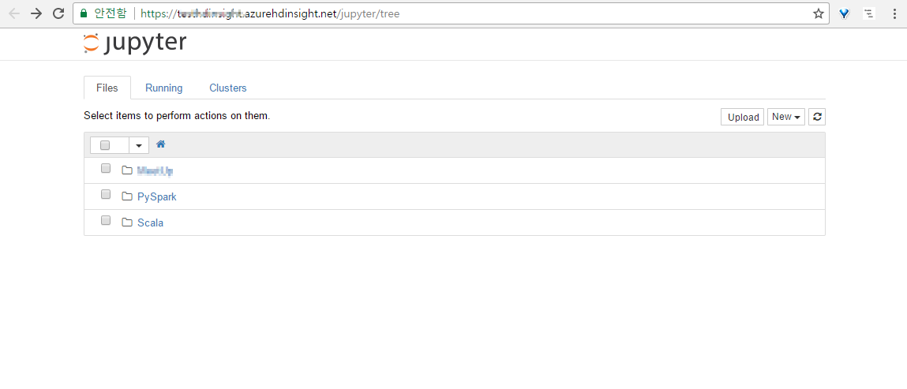

# HDInsight의 Spark 을 이용한 상품 추천 만들기(절차)

## 환경 구성

- client : Azure CLI on Window 10
- 배포 도구 : fabric
- 분석 도구 : Python3, Pandas, Spark Machine Learing Library(mllib)
- 데이터 스토리지 : Azure Blob

## Azure CLI on Window 10

### Bash Installation
- [설치가이드][1]

> PowerShell은 관리자 권한으로 실행시키되 64bit로 실행시키면 오류가 발생한다.


### Azure CLI Installation
- [설치가이드][2]

```
$ sudo apt-get install npm
$ sudo npm install azure-cli –g
# 아래가 필요할수도 있다.
($ sudo ln -s /usr/bin/nodejs /usr/bin/node)
# 기본 설치된 nodejs 버전이 낮다.
$ nodejs update
$ curl -sL https://deb.nodesource.com/setup_4.x | sudo -E bash – 
$ sudo apt-get install -y nodejs
```

설치 확인

```
$ azure help
```


## Azure Login

```
$ azure login
```


## HDInsight 클러스터 만들기

### 주의 사항

> `Azure CLI를 통해 입력하는 문자중 특수 문자($, # 등)를 주의`

> `Azure Portal 과 비교하여 결과 확인`

### 저장소 계정 만들기

```
$ azure storage account create -g <Resource Group Name> --sku-name RAGRS -l <Location> --kind Storage <Storage Account Name>
```

Location 목록 보기

```
$ azure location list
```

### 저장소 계정 액세스를 위한 키 검색

HDInsight 에서 사용하는 데이터를 저장하기 위해 위에서 생성한 저장소 접근 키가 필요하다.

```
$ azure storage account keys list -g <Resource Group Name> <Storage Account Name>
```

반환된 데이터에서 key1의 값을 저장해둔다.


### HDInsight 클러스터 생성

- [참고][3]

```
$ azure hdinsight cluster create \
-g <Resource Group Name> \
-l <Location> \
-y <클러스터 유형> \
--clusterType Spark \
--defaultStorageAccountName <Storage Account Name>.blob.core.windows.net \
--defaultStorageAccountKey <Storage Account Key> \
--defaultStorageContainer <Storage Account Name> \
--workerNodeCount 2 \
--userName <Admin Name> \
--password <Admin Password> \
--sshUserName <SSH User Name> \
--sshPassword <SSH User Password> <Cluster Name>
```

- 클러스터 유형 : Hadoop, HBase, Storm, Spark (여기서는 Spark)
- Admin Name, Admin Password : Dash Board, Ambari 로그인에 사용됨
- SSH User Name, SSH User Password : 클러스터의 Head Node 로그인에 사용됨

## 분석 데이터 업로드

- [Azure Storage Explorer 설치][4]


데이터 형태(CSV, 구분자:,)

| 컬럼      | 형태 | 값    |
|-----------|------|-------|
| userId    | 정수 | 1 ~ n |
| productId | 정수 | 1 ~ n |
| click     | 정수 | 1 ~ n |


## Jupyter Notebook을 이용하여 Python 코딩하기

### HDInsight Jupyter Notebook 접속




## 코드 작성

### Python Code 

Jupyter Notebook 에서 작성한 코드는 '<Storage Account Name>/HdiNotebooks' 에 저장된다.


jupyter notebook 에서 `CSV 파일 분석`을 위해 아래와 같은 코드를 실행시킨다.

```
%%configure
{ "conf": {"spark.jars.packages": "com.databricks:spark-csv_2.10:1.4.0" }}
```

### 모델 훈련

```python
from pyspark.mllib.recommendation import ALS, MatrixFactorizationModel
from pyspark.sql.types import StructType, StructField, StringType, IntegerType, FloatType, LongType
import math
import numpy as np
import pandas as pd


# 데이터 정의

click_struct = StructType([StructField("userId", StringType(), True), 
                          StructField("productId", IntegerType(), True), 
                          StructField("click", FloatType(), True)])
click_df = sqlContext.read.load('wasb:///<data-path-of-azureblobstorage>/userid-productid-views3.csv', 
                          'com.databricks.spark.csv', 
                          schema=click_struct,
                          header='false')


training_RDD, validation_RDD, test_RDD = click_df.randomSplit([6.0, 2.0, 2.0], seed=0)
validation_for_predict_RDD = validation_RDD.map(lambda x: (x[0], x[1]))
test_for_predict_RDD = test_RDD.map(lambda x: (x[0], x[1]))

# training

seed = 5
iterations = [5, 10, 15]
regularizations = [0.001, 0.01, 0.1, 1.0, 10.0]
ranks = [4, 8, 12, 16, 20]
errors = []
err = 0

min_error = float('inf')
best_rank = -1
best_iteration = -1
for rank in ranks:
    for it in iterations:
        for reg in regularizations:
            model = ALS.trainImplicit(training_RDD, 
                                      rank, 
                                      iterations=it, 
                                      lambda_=reg,
                                      seed=5)
            predictions = model.predictAll(validation_for_predict_RDD).map(lambda r: ((r[0], r[1]), r[2]))
            rates_and_preds = validation_RDD.map(lambda r: ((int(r[0]), int(r[1])), float(r[2]))).join(predictions)
            error = math.sqrt(rates_and_preds.map(lambda r: (r[1][0] - r[1][1])**2).mean())
            result = {'rank': rank, 'iteration': it, 'regularization': reg, 'RMSE': error}
            errors.append(result)
            if error <= min_error:
                min_error = error
                print('rank: %s, iteration: %s, regularization: %s, RMSE: %s' % (rank, it, reg, error))

# HyperParameter 를 이용하여 모델 만들기

rank = 20
it = 15
reg = 0.01

model = ALS.trainImplicit(train_df, rank, iterations=it, lambda_=reg, seed=5)

# 모델 저장

model.save(sc, 'wasb:///<data-path-of-azureblobstorage>/recommendation_model/')
```

### 데이터 예측(만들기)

```python
from pyspark.mllib.recommendation import ALS, MatrixFactorizationModel
from pyspark.sql.types import StructType, StructField, StringType, IntegerType, FloatType, LongType
import math, time, datetime
import numpy as np
import pandas as pd


# 모델 Load

model = MatrixFactorizationModel.load(sc, 'wasb:///<data-path-of-azureblobstorage>/recommendation_model/')

# 추천 결과 만들기

# 사용자별로 추천상품 목록(40개씩) user-to-item
# 결과는 파일로 저장

TopUsersAllProducts = model.recommendProductsForUsers(40)

# 상품별 사용자 목록(40개씩) item-to-user
# TopProductsAllUsers = model.recommendUsersForProducts(40)

today = datetime.datetime.today()
date_no = today.strftime('%Y%m%d%H%M%S')

for r in TopUsersAllProducts.collect():
    (u_id, rdd_rating) = r
    for r in rdd_rating:
        l.append((u_no_id[u_id], r.product, r.rating))
        if len(l) >= 1000:
            i += 1
            df = sqlContext.createDataFrame(l)
            df.write.format("com.databricks.spark.csv").save("wasb:///<data-path-of-azureblobstorage>/data/user-product" + str(date_no) + "/mycsv" + str(i))
            l = []
if len(l) > 0:
    i += 1
    df = sqlContext.createDataFrame(l)
    df.write.format("com.databricks.spark.csv").save("wasb:///<data-path-of-azureblobstorage>/data/user-product" + str(date_no) + "/mycsv" + str(i))

```


### Python code 수정(spark-submit 을 위해)

Head Node 에 로그인하여 아래와 같은 형태로 실행시켜야 한다.

```
$ spark-submit --packages com.databricks:spark-csv_2.10:1.4.0 pyspark_example.py
```

위에서 Jupyter Notebook 으로 작성된 코드를 참고하여 아래와 같은 코드(pyspark_example.py)를 만든다.

```python
#-*- coding:utf-8-*-
from pyspark.mllib.recommendation import ALS, MatrixFactorizationModel
from pyspark.sql.types import StructType, StructField, StringType, IntegerType, FloatType, LongType
import math, time, datetime
import numpy as np
import pandas as pd


conf = SparkConf().setAppName("building a recommendation")
sc = SparkContext(conf=conf)

sqlContext = SQLContext(sc)

#
# 이하 동일
#

```

## Automation

아래와 같은 순서로 진행한다.

- (HDInsight 를 위한 저장소 계정 생성)
- HDInsight Cluster 생성
- 로컬에 저장된 Python Script 를 HDInsight 의 Head Node 에 업로드
- python3 pip 설치
- 분석을 위해 필요한 추가 패키지 설치(예: pandas)
- python script를 spark 클러스터에 submit
- HDInsight Cluster 삭제

HDInsight 클러스터 생성과 삭제를 제외하고 나머지 부분은 Python 의 배포 도구인 fabric을 이용한다.

### fabric(Python3) 설치

```
$ sudo pip3 install fabric3
```


### 클러스터 생성

HDInsight 클러스터 만들기 참고

### fabfile.py

```python
from fabric.api import *

env.hosts = ["<head node ssh>.azurehdinsight.net"]
env.user = "<User Name>"
env.password = "<User Password>"

def uploadPythonScript():
    put('pyspark_example.py', '<script 를 저장할 head node 의 경로>')

def pipInstall():
    sudo('apt -y install  python3-pip')

def pandasInstall():
    sudo('pip3 install pandas')

def executePySpark():
    run("export PYSPARK_PYTHON=python3; spark-submit --packages com.databricks:spark-csv_2.10:1.4.0 pyspark_example.py")

def deploy():
    uploadPythonScript()
    pipInstall()
    pandasInstall()
    executePySpark()

```

실행

```
$ fab deploy
```

### 클러스터 지우기

```
$ azure hdinsight cluster delete <Cluster Name> -g <Resource Group Name>
```

### bash script 로 만들기

```
#!/bin/bash

./<HDInsight Cluster Create Script>.sh

fab deploy

./<HDInsight Cluster Delete Script>.sh
```


## 6. 상품 유사도 측정

- [MinHash] [5] 참고


[1]: https://msdn.microsoft.com/commandline/wsl/install_guide
[2]: https://github.com/Azure/azure-content-kokr/blob/master/articles/xplat-cli-install.md
[3]: https://docs.microsoft.com/ko-kr/azure/hdinsight/hdinsight-hadoop-create-linux-clusters-azure-cli
[4]: http://storageexplorer.com/
[5]: https://ekzhu.github.io/datasketch/minhash.html